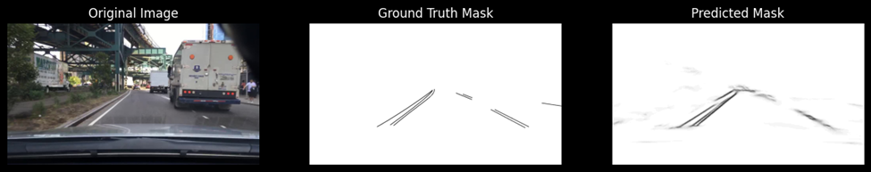

# Lane Detection with UNet and Attention Mechanisms

- Download the dataset from [BDD100K](https://dl.cv.ethz.ch/bdd100k/data/)

## Model Architecture

The UNet model is implemented with the following architecture:

- **Encoder**: A series of convolutional layers followed by batch normalization and ReLU activation.
- **Bottleneck**: A set of convolutional layers that capture the deepest features.
- **Decoder**: A series of transposed convolutional layers that upsample the features back to the original image size.

```python
class UNet(nn.Module):
    def __init__(self, in_channels, out_channels):
        super(UNet, self).__init__()

        def CBR(in_channels, out_channels):
            return nn.Sequential(
                nn.Conv2d(in_channels, out_channels, kernel_size=3, padding=1),
                nn.BatchNorm2d(out_channels),
                nn.ReLU(inplace=True),
                nn.Conv2d(out_channels, out_channels, kernel_size=3, padding=1),
                nn.BatchNorm2d(out_channels),
                nn.ReLU(inplace=True)
            )

        self.enc1 = CBR(in_channels, 64)
        self.enc2 = CBR(64, 128)
        self.enc3 = CBR(128, 256)
        self.enc4 = CBR(256, 512)
        # Define other layers...

    def forward(self, x):
        # Implement forward pass...
        pass
```
## Installation

1. Clone the repository:
```bash
git clone 
cd Lane-Detection-UNet
```

2. Create a virtual environment and activate it:
```bash
python39 -m venv .venv
.venv\Scripts\activate  # On Linux use `source venv/bin/activate`
```
3. Install the required dependencies:
```bash
pip install -r requirements.txt
```

4. Install the torch and torchvision packages to run with cuda:
```bash
pip3 install torch torchvision torchaudio --index-url https://download.pytorch.org/whl/cu118
```

## Usage
### Training
The model is trained on NVIDIA A6000 GPU with 48GB VRAM. The training takes approximately 10-12 hours on these specs. To train the model, run:
```bash
python train.py
```

### Evaluation
Once the model is trained, you can evaluate the model's performance on the validation set (10,000 images) in termms of metrics like the Jaccard Score (IoU), Accuracy, and F1-Score. You can make necessary changes to eval_lane.py and then run the following command in order to evaluate the model:
```bash
python eval-lane.py
```

### Inference 
To run inference on a single image and save the predicted mask in the pred folder, use:
```bash
python inference.py
```


## Results
The model was evaluated on the following metrics over the validation set:
- Validation Jaccard Score (IoU): 0.9942
- Validation Accuracy: 0.9942
- Validation F1 Score: 0.9971

Here's a look at the model's predicted mask being compared to the ground truth mask on a sample image:


